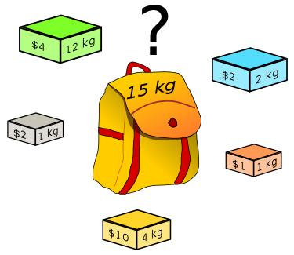

# 背包问题：

背包问题是动态规划非常重要的一类问题，它有很多变种，但题目千变万化都离不开我根据力扣上背包问题的题解和一些大佬的经验总结的解题模板。

## 背包定义：

那么什么样的问题可以被称作为背包问题？换言之，我们拿到题目如何透过题目的不同包装形式看到里面背包问题的不变内核呢？  
我对背包问题定义的理解：    
> 给定一个背包容量target，再给定一个数组nums(物品)，能否按一定方式选取nums中的元素得到target    

**注意**：    
1、背包容量target和物品nums的类型可能是数，也可能是字符串    
2、target可能题目已经给出(显式)，也可能是需要我们从题目的信息中挖掘出来(非显式)(常见的非显式target比如sum/2等)    
3、选取方式有常见的一下几种：每个元素选一次/每个元素选多次/选元素进行排列组合    
那么对应的背包问题就是下面我们要讲的背包分类

## 背包问题分类：

常见的背包类型主要有以下几种：  
1、**0/1背包问题**：每个元素最多选取一次    
2、**完全背包问题**：每个元素可以重复选择    
3、**组合背包问题**：背包中的物品要考虑顺序    
4、**分组背包问题**：不止一个背包，需要遍历每个背包  

而每个背包问题要求的也是不同的，按照所求问题分类，又可以分为以下几种：  
1、**最值问题**：要求最大值/最小值    
2、**存在问题**：是否存在…………，满足…………  
3、**组合问题**：求所有满足……的排列组合

因此把背包类型和问题类型结合起来就会出现以下细分的题目类型：  
1、0/1背包最值问题  
2、0/1背包存在问题  
3、0/1背包组合问题  
4、完全背包最值问题  
5、完全背包存在问题  
6、完全背包组合问题  
7、分组背包最值问题  
8、分组背包存在问题  
9、分组背包组合问题  
这九类问题我认为几乎可以涵盖力扣上所有的背包问题

## 背包问题解题模板

首先先了解一下原始背包问题的解题思路和代码：   
最开始的背包问题是二维动态规划  

```c++
// 0-1背包问题母代码(二维)
void bags()
{
    vector<int> weight = {1, 3, 4};   //各个物品的重量
    vector<int> value = {15, 20, 30}; //对应的价值
    int bagWeight = 4;                //背包最大能放下多少重的物品

    // 二维数组：状态定义:dp[i][j]表示从0-i个物品中选择不超过j重量的物品的最大价值
    vector<vector<int>> dp(weight.size() + 1, vector<int>(bagWeight + 1, 0));

    // 初始化:第一列都是0，第一行表示只选取0号物品最大价值
    for (int j = bagWeight; j >= weight[0]; j--)
        dp[0][j] = dp[0][j - weight[0]] + value[0];

    // weight数组的大小 就是物品个数
    for (int i = 1; i < weight.size(); i++) // 遍历物品(第0个物品已经初始化)
    {
        for (int j = 0; j <= bagWeight; j++) // 遍历背包容量
        {
            if (j < weight[i])           //背包容量已经不足以拿第i个物品了
                dp[i][j] = dp[i - 1][j]; //最大价值就是拿第i-1个物品的最大价值
            //背包容量足够拿第i个物品,可拿可不拿：拿了最大价值是前i-1个物品扣除第i个物品的 重量的最大价值加上i个物品的价值
            //不拿就是前i-1个物品的最大价值,两者进行比较取较大的
            else
                dp[i][j] = max(dp[i - 1][j], dp[i - 1][j - weight[i]] + value[i]);
        }
    }
    cout << dp[weight.size() - 1][bagWeight] << endl;
}
```

二维代码可以进行优化，去除选取物品的那一层，简化为一维背包    
// 一维  
//状态定义：dp\[j]表示容量为j的背包能放下东西的最大价值  

```c++
void test_1_wei_bag_problem()
{
    vector<int> weight = {1, 3, 4};
    vector<int> value = {15, 20, 30};
    int bagWeight = 4;

    // 初始化
    vector<int> dp(bagWeight + 1, 0);
    for (int i = 0; i < weight.size(); i++)
    { // 遍历物品
        for (int j = bagWeight; j >= weight[i]; j--)
        {                                                     // 遍历背包容量(一定要逆序)
            dp[j] = max(dp[j], dp[j - weight[i]] + value[i]); //不取或者取第i个
        }
    }
    cout << dp[bagWeight] << endl;
}
```

但是这样的代码用来解题显然还是让人一头雾水的，下面给出的解题模板可以很好地将解决这个问题

### 分类解题模板

背包问题大体的解题模板是两层循环，分别遍历物品nums和背包容量target，然后写转移方程，  
根据背包的分类我们确定物品和容量遍历的先后顺序，根据问题的分类我们确定状态转移方程的写法

**首先是背包分类的模板：**  
1、**0/1背包**：外循环`nums`, 内循环`target`, `target`倒序且`target>=nums[i]`;  
2、**完全背包**：外循环`nums`, 内循环`target`, `target`正序且`target>=nums[i]`;  
3、**组合背包**：外循环`target`, 内循环`nums`, `target`倒序且`target>=nums[i]`;  
4、**分组背包**：这个比较特殊，需要三重循环：外循环背包bags,内部两层循环根据题目的要求转化为1,2,3三种背包类型的模板

**然后是问题分类的模板：**  
1、**最值问题**: `dp[i] = max/min(dp[i], dp[i-nums]+1)`或`dp[i] = max/min(dp[i], dp[i-num]+nums)`;  
2、**存在问题(bool)**：`dp[i]=dp[i] || dp[i-num]`;  
3、**组合问题**：`dp[i]+=dp[i-num]`;

这样遇到问题将两个模板往上一套大部分问题就可以迎刃而解  
下面看一下具体的题目分析：  
### 322. 零钱兑换  
// 零钱兑换：给定amount,求用任意数量不同面值的零钱换到amount所用的最少数量  
// 完全背包最值问题：外循环coins,内循环amount正序,应用状态方程1

```c++
int coinChange(vector<int> &coins, int amount)
{
    vector<long long> dp(amount + 1, INT_MAX); //给dp数组每个位置赋初值为INT_MAX是为了最后判断是否能填满amount,要用long long 类型
    dp[0] = 0;  //dp[i]:换到面值i所用的最小数量
    for (int coin : coins)
    {
        for (int i = 0; i <= amount; i++)
        {
            if (coin <= i)
                dp[i] = min(dp[i], dp[i - coin] + 1);
        }
    }
    return dp[amount] == INT_MAX ? -1 : dp[amount];
}
```

### 416. 分割等和子集  
// 分割等和子集：判断是否能将一个数组分割为两个子集,其和相等  
// 0-1背包存在性问题：是否存在一个子集,其和为target=sum/2,外循环nums,内循环target倒序,应用状态方程2

```c++
bool canPartition(vector<int> &nums)
{
    int sum = accumulate(nums.begin(), nums.end(), 0);
    if (sum % 2 == 1)  //如果是和为奇数显然无法分成两个等和子集
        return false;
    int target = sum / 2; 
    vector<int> dp(target + 1, 0); //dp[i]:是否存在子集和为i
    dp[0] = true;   //初始化：target=0不需要选择任何元素，所以是可以实现的
    for (int num : nums)
        for (int i = target; i >= num; i--)
            dp[i] = dp[i] || dp[i - num];
    return dp[target];
}
```

### 494. 目标和  
// 目标和：给数组里的每个数字添加正负号得到target  
// 数组和sum,目标和s, 正数和x,负数和y,则x+y=sum,x-y=s,那么x=(s+sum)/2=target  
// 0-1背包不考虑元素顺序的组合问题:选nums里的数得到target的种数,外循环nums,内循环target倒序,应用状态方程3

```c++
int findTargetSumWays(vector<int> &nums, int s)
{
    int sum = accumulate(nums.begin(), nums.end(), 0);
    if ((sum + s) % 2 != 0 || sum < s)
        return 0;
    int target = (sum + s) / 2;
    vector<int> dp(target + 1);
    dp[0] = 1;
    for (int num : nums)
        for (int i = target; i >= num; i--)
            dp[i] += dp[i - num];
    return dp[target];
}
```

### 279. 完全平方数  
// 完全平方数：对于一个正整数n,找出若干个完全平方数使其和为n,返回完全平方数最少数量  
// 完全背包的最值问题：完全平方数最小为1,最大为sqrt(n),故题目转换为在nums=\[1,2.....sqrt(n)]中选任意数平方和为target=n  
// 外循环nums,内循环target正序,应用转移方程1

```c++
int numSquares(int n)
{
    vector<int> dp(n + 1, INT_MAX); //dp[i]:和为i的完全平方数的最小数量
    dp[0] = 0;
    for (int num = 1; num <= sqrt(n); num++)
    {
        for (int i = 0; i <= n; i++)
        {
            if (i >= num * num)
                dp[i] = min(dp[i], dp[i - num * num] + 1);
        }
    }
    return dp[n];
}
```

### 377. 组合总和 Ⅳ  
//组合总和IV：在nums中任选一些数,和为target  
// 考虑顺序的组合问题：外循环target,内循环nums,应用状态方程3

```c++
int combinationSum4(vector<int> &nums, int target)
{
    vector<int> dp(target + 1);
    dp[0] = 1;
    for (int i = 1; i <= target; i++)
    {
        for (int num : nums)
        {
            if (num <= i) 
                dp[i] += dp[i - num];
        }
    }
    return dp[target];
}
```

### 518. 零钱兑换 II  
// 零钱兑换2：任选硬币凑成指定金额,求组合总数  
// 完全背包不考虑顺序的组合问题：外循环coins,内循环target正序,应用转移方程3

```c++
int change(int amount, vector<int> &coins)
{
    vector<int> dp(amount + 1);
    dp[0] = 1;
    for (int coin : coins)
        for (int i = 1; i <= amount; i++)
            if (i >= coin)
                dp[i] += dp[i - coin];
    return dp[amount];
}
```

### 1049. 最后一块石头的重量 II  
这道题看出是背包问题比较有难度  
最后一块石头的重量：从一堆石头中,每次拿两块重量分别为x,y的石头,若x=y,则两块石头均粉碎;若x<y,两块石头变为一块重量为y-x的石头求最后剩下石头的最小重量(若没有剩下返回0)  
问题转化为：把一堆石头分成两堆,求两堆石头重量差最小值  
进一步分析：要让差值小,两堆石头的重量都要接近sum/2;我们假设两堆分别为A,B,A<sum/2,B>sum/2,若A更接近sum/2,B也相应更接近sum/2  
进一步转化：将一堆stone放进最大容量为sum/2的背包,求放进去的石头的最大重量MaxWeight,最终答案即为sum-2*MaxWeight;、  
0/1背包最值问题：外循环stones,内循环target=sum/2倒叙,应用转移方程1

```c++
int lastStoneWeightII(vector<int> &stones)
{
    int sum = accumulate(stones.begin(), stones.end(), 0);
    int target = sum / 2;
    vector<int> dp(target + 1);
    for (int stone : stones)
        for (int i = target; i >= stone; i--)
            dp[i] = max(dp[i], dp[i - stone] + stone);
    return sum - 2 * dp[target];
}
```

### 1155. 掷骰子的N种方法  
// 投掷骰子的方法数：d个骰子,每个有f个面(点数为1,2,...f),求骰子点数和为target的方法    
// 分组0/1背包的组合问题：`dp[i][j]`表示投掷i个骰子点数和为j的方法数;  
// 三层循环：最外层为背包d,然后先遍历target后遍历点数f;  
// 应用二维拓展的转移方程3：`dp[i][j]+=dp[i-1][j-f]`;

```c++
int numRollsToTarget(int d, int f, int target)
{
    vector<vector<int>> dp(d + 1, vector<int>(target + 1, 0));
    dp[0][0] = 1;
    for (int i = 1; i <= d; i++)
        for (int j = 1; j <= target; j++)
            for (int k = 1; k <= f && j >= k; k++)
                dp[i][j] += dp[i - 1][j - k];
    return dp[d][target];
}
```

那么背包问题到这里就全部总结完毕了，相信看了这篇文章大家对背包问题的理解又上了一个全新的层次。  