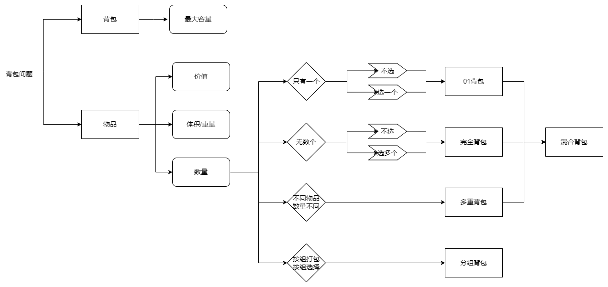

[原文]([代码随想录 (programmercarl.com)](https://programmercarl.com/%E8%83%8C%E5%8C%85%E7%90%86%E8%AE%BA%E5%9F%BA%E7%A1%8001%E8%83%8C%E5%8C%85-1.html#%E7%AE%97%E6%B3%95%E5%85%AC%E5%BC%80%E8%AF%BE))
# 背包问题分类

# 01背包
有n件物品和一个最多能背重量为w 的背包。第i件物品的重量是weight\[i]，得到的价值是value\[i] 。**每件物品只能用一次**，求解将哪些物品装入背包里物品价值总和最大。  
每一件物品其实只有两个状态，取或者不取，所以可以使用回溯法搜索出所有的情况，那么时间复杂度就是$o(2^n)$，这里的n表示物品数量。  
**所以暴力的解法是指数级别的时间复杂度。进而才需要动态规划的解法来进行优化！**  
# 二维dp数组01背包
## dp数组

**dp\[i]\[j] 表示从下标为\[0-i]的物品里任意取，放进容量为j的背包，价值总和最大是多少**。  
## 递推公式
再回顾一下dp\[i]\[j]的含义：从下标为\[0-i]的物品里任意取，放进容量为j的背包，价值总和最大是多少。  

那么可以有两个方向推出来dp\[i]\[j]，

- **不放物品i**：由dp\[i - 1]\[j]推出，即背包容量为j，里面不放物品i的最大价值，此时dp\[i]\[j]就是dp\[i - 1]\[j]。(其实就是当物品i的重量大于背包j的重量时，物品i无法放进背包中，所以背包内的价值依然和前面相同。)  
- **放物品i**：由dp\[i - 1]\[j - weight\[i]]推出，dp\[i - 1]\[j - weight\[i]] 为背包容量为j - weight\[i]的时候不放物品i的最大价值，那么dp\[i - 1]\[j - weight\[i]] + value\[i] （物品i的价值），就是背包放物品i得到的最大价值  

所以递归公式： dp\[i]\[j] = max(dp\[i - 1]\[j], dp\[i - 1]\[j - weight\[i]] + value\[i]);  
## dp数组初始化
首先从dp\[i]\[j]的定义出发，如果背包容量j为0的话，即dp\[i]\[0]，无论是选取哪些物品，背包价值总和一定为0。    
状态转移方程 dp\[i]\[j] = max(dp\[i - 1]\[j], dp\[i - 1]\[j - weight\[i]] + value\[i]); 可以看出i 是由 i-1 推导出来，那么i为0的时候就一定要初始化。  
dp\[0]\[j]，即：i为0，存放编号0的物品的时候，各个容量的背包所能存放的最大价值。  
>那么很明显当 j < weight\[0]的时候，dp\[0]\[j] 应该是 0，因为背包容量比编号0的物品重量还小。  
  当j >= weight\[0]时，dp\[0]\[j] 应该是value\[0]，因为背包容量放足够放编号0物品。  
## 遍历顺序
**先遍历物品更好理解**
```c++
// weight数组的大小 就是物品个数
for(int i = 1; i < weight.size(); i++) { // 遍历物品
    for(int j = 0; j <= bagweight; j++) { // 遍历背包容量
        if (j < weight[i]) dp[i][j] = dp[i - 1][j];
        else dp[i][j] = max(dp[i - 1][j], dp[i - 1][j - weight[i]] + value[i]);

    }
}
```
# 滚动数组01背包
> 把二维dp降为一维dp
## 一维dp数组（滚动数组）
对于背包问题其实状态都是可以压缩的。  

在使用二维数组的时候，递推公式：dp\[i]\[j] = max(dp\[i - 1]\[j], dp\[i - 1]\[j - weight\[i]] + value\[i]);

**其实可以发现如果把dp\[i - 1]那一层拷贝到dp\[i]上，表达式完全可以是：dp\[i]\[j] = max(dp\[i]\[j], dp\[i]\[j - weight\[i]] + value\[i]);**  

**与其把dp\[i - 1]这一层拷贝到dp\[i]上，不如只用一个一维数组了**，只用dp\[j]（一维数组，也可以理解是一个滚动数组）。  

这就是滚动数组的由来，需要满足的条件是上一层可以重复利用，直接拷贝到当前层。  

读到这里估计大家都忘了 dp\[i]\[j]里的i和j表达的是什么了，i是物品，j是背包容量。  

**dp\[i]\[j] 表示从下标为\[0-i]的物品里任意取，放进容量为j的背包，价值总和最大是多少**。
## 一维dp数组解法
### 确定dp数组含义
在一维dp数组中，dp\[j]表示：容量为j的背包，所背的物品价值可以最大为dp\[j]。
### 一维dp数组的递推公式
dp\[j]为 **容量为j的背包所背的最大价值**，那么如何推导dp\[j]呢？    
dp\[j]可以通过dp\[j - weight\[i]]推导出来，dp\[j - weight\[i]]表示容量为j - weight\[i]的背包所背的最大价值。  
dp\[j - weight\[i]] + value\[i] 表示 容量为 j - 物品i重量 的背包 加上 物品i的价值。（也就是容量为j的背包，放入物品i了之后的价值即：dp\[j]）  
此时dp\[j]有两个选择，一个是取自己dp\[j] 相当于 二维dp数组中的dp\[i-1]\[j]，即不放物品i，一个是取dp\[j - weight\[i]] + value\[i]，即放物品i，指定是取最大的，毕竟是求最大价值，
所以递归公式为：
```
dp[j] = max(dp[j], dp[j - weight[i]] + value[i]);
```
###  一维dp数组初始化
dp\[j]表示：容量为j的背包，所背的物品价值可以最大为dp\[j]，那么dp\[0]就应该是0，因为背包容量为0所背的物品的最大价值就是0。  

那么dp数组除了下标0的位置，初始为0，其他下标应该初始化多少呢？  

看一下递归公式：dp\[j] = max(dp\[j], dp\[j - weight\[i]] + value\[i]);  

dp数组在推导的时候一定是取价值最大的数，如果题目给的价值都是正整数那么非0下标都初始化为0就可以了。  

**这样才能让dp数组在递归公式的过程中取的最大的价值，而不是被初始值覆盖了**。  

那么我假设物品价值都是大于0的，所以dp数组初始化的时候，都初始为0就可以了。  
### 一维dp数组遍历顺序
二维dp遍历的时候，背包容量是从小到大，而一维dp遍历的时候，背包是从大到小。  
**倒序遍历是为了保证物品i只被放入一次！**。但如果一旦正序遍历了，那么物品0就会被重复加入多次！  

举一个例子：物品0的重量weight\[0] = 1，价值value\[0] = 15  

如果正序遍历  

dp\[1] = dp\[1 - weight\[0]] + value\[0] = 15  

dp\[2] = dp\[2 - weight\[0]] + value\[0] = 30  

此时dp\[2]就已经是30了，意味着物品0，被放入了两次，所以不能正序遍历。  

为什么倒序遍历，就可以保证物品只放入一次呢？  

倒序就是先算dp\[2]  

dp\[2] = dp\[2 - weight\[0]] + value\[0] = 15 （dp数组已经都初始化为0）  

dp\[1] = dp\[1 - weight\[0]] + value\[0] = 15  

所以从后往前循环，每次取得状态不会和之前取得状态重合，这样每种物品就只取一次了。  

遍历伪代码
```c++
for(int i = 0; i < weight.size(); i++) { // 遍历物品
    for(int j = bagWeight; j >= weight[i]; j--) { // 遍历背包容量
        dp[j] = max(dp[j], dp[j - weight[i]] + value[i]);

    }
}
```

**不可以先遍历背包容量嵌套遍历物品！**  
因为一维dp的写法，背包容量一定是要倒序遍历（原因上面已经讲了），如果遍历背包容量放在上一层，那么每个dp\[j]就只会放入一个物品，即：背包里只放入了一个物品。  

倒序遍历的原因是，本质上还是一个对二维数组的遍历，并且右下角的值依赖上一层左上角的值，因此需要保证左边的值仍然是上一层的，从右向左覆盖。  
